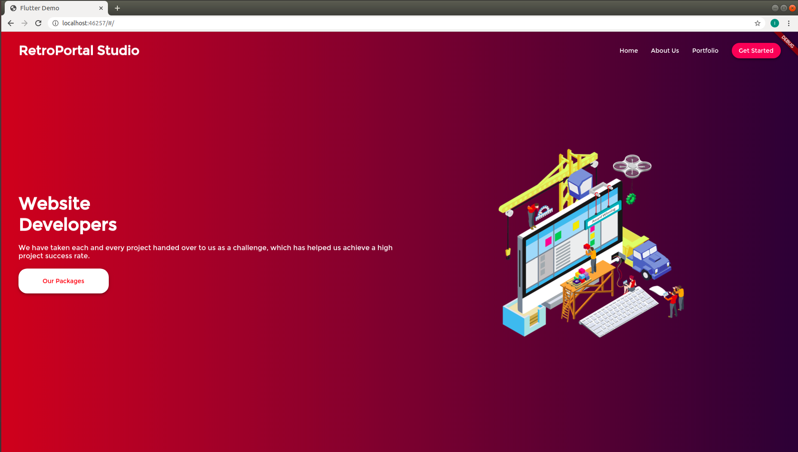
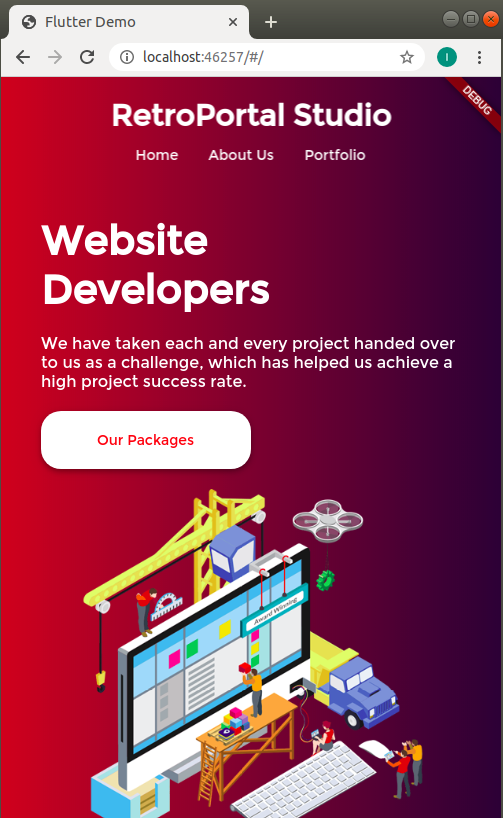

# retro-portal-studio

Projeto web utilizando Flutter para entender mais sobre a responsividade para diferentes tamanhos de tela.

O mesmo foi baseado no [vídeo do RetroPortal Studio no Youtube](https://www.youtube.com/watch?v=rpkKYQCioW0&t=748s).

### Responsividade Desktop

### Responsividade Web Mobile

Para testar basta ter o ambiente de programação flutter instalado e clonar o repositório.

